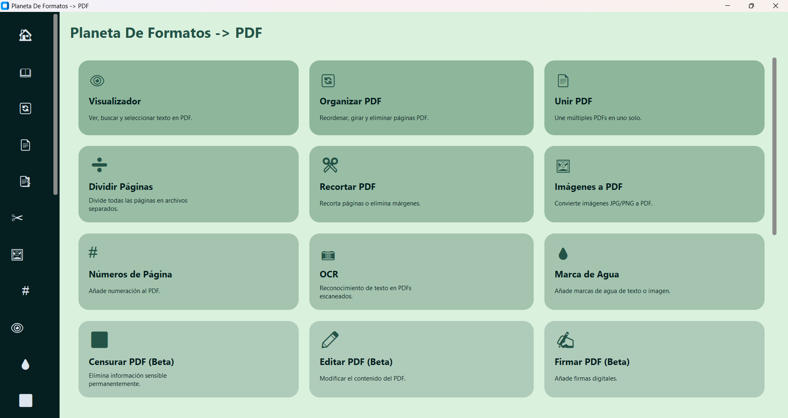
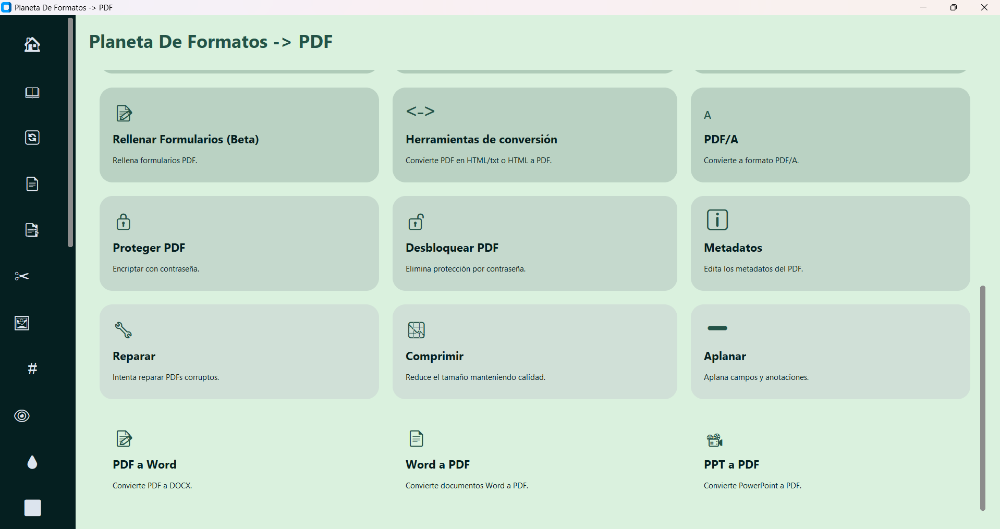

# Planeta De Formatos -> PDF 📚

This project is designed for students, professionals, and anyone who needs a tool to manage, edit, and manipulate PDF files in a more dynamic way. Although all these functions are available on the market, there are additional touches that could be very useful for the user experience. It only uses local files, making it safer and more reliable.

<p align="center">
  
</p>

<p align="center">
  
</p>

# Executable

The executable is too heavy for GitHub, but you can download it safely from the official server. Completely ready to use:

[Download Executable v1.0 (Google Drive)](https://drive.google.com/file/d/1nrVPgHzEC3LmEB0YnteEWK2FxLmijagk/view?usp=sharing)

## Main Features

### Organization and Management
- **Merge PDF**: Combine multiple PDF files visually, selecting the pages you want to merge from each file. 
With advanced selection, you can select page ranges from each file. For example, if you have 3 PDF files, the first has 10 pages, the second 20, and the third 30, you can select pages 1-5 and 10 from the first, 6-10 from the second, 11-15 from the third, and return to the first (or any) for pages 7-9. Each file is identified by a letter; in this example (three files), they would be A, B, and C. The selection would look like this: **(A:1-5,10)(B:6-10)(C:11-15)(A:7-9)**. This will create your new PDF, which is very useful for files with many pages to avoid selecting them one by one.
- **Split PDF**: Define ranges of a PDF to split it into several PDFs. This function includes 5 options:
   - Image range: Creates images only of the pages in the selected ranges (all ranges in the list).
   - All images: Creates images of all pages in the PDF. (Creating a dedicated folder for the images is recommended).
   - Split ranges: Creates individual PDFs for each defined range.
   - Split all: Creates individual PDFs for every page of the document. (Creating a dedicated folder for the PDFs is recommended).
   - Merge ranges: Creates a single PDF with the pages from all selected ranges (all ranges in the list).
- **Organize PDF**: Visually reorder pages using Drag & Drop, rotate them as needed, and delete unwanted pages. Supports PDF files, Word documents, and images. 
(Attempting to drag PPT or Excel files will try to convert them to PDF for display, but it may not work perfectly).
- **Crop**: Precisely adjust page margins and dimensions. Three options available:
   - Cropped PDF: Creates a PDF containing only the sections cropped by the user.
   - Full PDF with crops: Creates a PDF where non-cropped pages are kept, and pages with crops are replaced by the selected crop section(s).
   - Generate images: Generates images from the cropped sections.

### 📝 Editing and Annotation
- **PDF Editor (BETA)**: Modify content, add text, shapes, and drawings directly onto the document.
- **Redact (BETA)**: Permanently and securely redact sensitive information.
- **Watermark**: Add custom watermarks (text or image) with full control over opacity, size, and rotation.
- **Page Numbers**: Insert automatic numbering in different positions.
- **Fill Forms (BETA)**: Automatically detect and fill interactive form fields.

### 🔄 Intelligent Conversion
- **Images to PDF**: Convert batches of images (JPG, PNG, BMP, etc.) into PDF documents.
- **Office Suite**: High-fidelity bidirectional conversion between PDF and Word (.docx). Excel (.xlsx) and PowerPoint (.pptx) support requires further development and testing for optimal performance.
- **OCR (Optical Character Recognition)**: Transform scanned PDFs or document photos into editable and searchable text.
- **HTML to PDF**: Capture and convert entire web pages to PDF while maintaining the original layout.

### 🛡️ Security and Optimization
- **Protect and Unlock**: Manage open passwords and editing/printing permissions.
- **Compress**: Optimize file size without sacrificing readability.
- **Metadata**: Edit internal file information (Author, Title, Subject, etc.).
- **Repair**: Recover and rebuild PDF files that are corrupted or have errors.
- **PDF/A Standard**: Convert documents to the long-term archiving standard.

### 📖 Viewing and Signing
- **Integrated Viewer**: Smooth viewer with search functions, text selection, and quick copy. Designed for searching and features a "jump" function to skip to the necessary tool.
- **Sign PDF**: Support for visual signatures (drawn or images) and digital signatures based on certificates (.p12 / .pfx).

## Installation and Configuration

### Prerequisites
- **Python 3.10+**
- **Tesseract OCR**: The project includes a `bin` folder with the Tesseract executable, but it is recommended (though not mandatory) to have it installed on the system for text recognition functions.
- **Playwright**: For HTML to PDF conversion.

### Installation Steps

1. **Clone the repository**:
   ```bash
   git clone <repository-url>
   cd PlanetaDFormatos
   ```

2. **Virtual Environment**:
   ```bash
   python -m venv .venv
   # Activate on Windows:
   .venv\Scripts\activate
   ```

3. **Dependencies**:
   ```bash
   pip install -r requirements.txt
   ```

4. **Web Conversion Browsers**:
   ```bash
   playwright install chromium
   ```

### How to Run
Start the application by running the main script:
```bash
python main.py
```

## 📦 Technologies Used
- **Interface**: `customtkinter`, `tkinterdnd2`, `ttkthemes`.
- **PDF Engine**: `PyMuPDF (fitz)`, `pypdf`, `reportlab`, `pikepdf`.
- **Conversion**: `pdf2docx`, `docx2pdf`, `python-docx`, `python-pptx`, `pytesseract`, `playwright`.
- **Processing**: `Pillow`, `opencv-python`, `pandas`.
- **Digital Signature**: `pyhanko`.

## ⚖️ License
This project is proprietary software. See the `COMMERCIAL_LICENSE.md` file for more details on usage terms.

---
© 2026 Planeta De Formatos. All rights reserved.